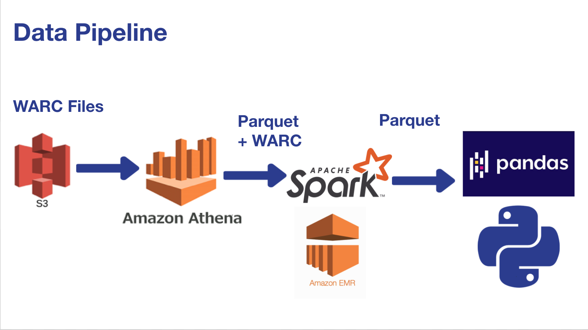

# Table of Contents 
1. [Introduction](README.md#introduction)
2. [Pipeline](README.md#pipeline)
3. [Requirements](README.md#requirements)
4. [Environment Set Up](README.md#Environment%20Setup)
5. [Repository Structure and Run Instructions](README.md#Repository%20Structure%20and%20Run%20Instructions)


# Introduction
**Price Crawler: Tracking Price Inflation**

This is a project completed in 3 weeks during the Insight Data Engineering Program (New York, 20B Session). The goal of this project is to calculate inflation rates from first principles.
That means calculating inflation rate using prices of goods and services sold online.

In this project, I built a pipleine to use petabytes of web page data contained in the [Common Crawl](https://commoncrawl.org/), an archive of web page content 
to calculate inflation rates. The results can be used to enhance investment strategies or by businesses in deciding the cost of products. A sample batch job has 
been executed using online laptop prices ($500-$800) and the inflation rate in 2019 is measured to be 4.8% which is more than double the annual inflation rate of 
2.3% reported by Bureau of labor statistics for 2019. A recording of the WebUI is also available [here](https://www.youtube.com/watch?v=mNcodsH5254&feature=youtu.be). 

# Pipeline
I built a data pipeline that utilizes petabytes of publicly available web page data to **Calculate Inflation rates from first principles (Prices of Products)**



1. AWS Athena to query indexed WARC Files using HTTP header information in WARC Files
    * Scan 0(100 GB) data instead of PB
2. **Keys** to webpages of interest saved in parquet files on S3
3. Parquet + WARC input to Spark with distributed processing over O(10 GB) data per job
4. Cleaning, filtering and aggregating Product and Price tables with Pandas in Python
5. Plotting and tracking price trends with Dash

# Requirements

1)  S3:  Set up and S3 bucket.  In this case:  s3://athena-east-2-usama/
2)  Athena:  Open Athena on AWS.  Follow the instructions to set up "Running SQL Queries with Athena" here:  https://commoncrawl.org/2018/03/index-to-warc-files-and-urls-in-columnar-format/
3)  Run Athena with the example in https://github.com/uhussain/WebCrawlerForOnlineInflation/athena/athena_instructions.txt
4)  Start EMR in Amazon with Spark and Hadoop.  SSH in.
5)  Add the following to ~/.bashrc and source ~/.bashrc:
export SPARK_HOME=/usr/lib/spark
export PYTHONPATH=$SPARK_HOME/python/lib/py4j-0.10.7-src.zip:$PYTHONPATH  
export PYTHONPATH=$SPARK_HOME/python:$SPARK_HOME/python/build:$PYTHONPATH
6)  Install the following on EMR (both master and workers) with "pip install --user":  warcio, boto3, bs4, nltk 
7)  Execute main.py in master node.

**Languages** 
* Bash
* Python 3.7
* Pandas

**Technologies**
* Spark
* AWS Athena
* Dash/Plotly

**Third-Party Libraries**
* AWS CLI

# Environment Setup
Install and configure [AWS](https://aws.amazon.com/cli/) and the open-source tool and setup an AWS EMR cluster. At launch time, emr-5.30.0 version was used.
It comes with Python version 3.7.6, pyspark version 2.4.5-amzn-0 and Zeppelin 0.8.2.


**AWS EMR Clusters Setup**

Currently using only one master node and two core nodes (can be scaled up)

# Repository Structure and Run Instructions


`./athena/` contains instructions on how to query common crawl data with AWS Athena .

`./spark/` contains the main.py spark script to launch spark jobs using the output from athena query

```
spark-submit ./spark/main.py -in walmart_laptops_2018 -o walmart_parquet_2018
```

`./pandas/`contains python script to clean the output from spark and provide csv file to dashapp/app.py

```
python3 pandas/cleaner.py
```

`./dashapp/` contains a dash app to visualize trends in online prices in laptops across time

```
python3 dashapp/price_tracker.py
```

# Development work
I built a rapid prototype of the pipeline during the first week to understand the scope of the problem and learn textual and HTML content analysis. 
Ingested data from AWS S3, cleaned and filtered with single-threaded python script and aggregated product information in a local Amazon DyanmoDB database

`./prototype/` contains all python configuration files and scripts for running the project locally and output product info to a local amazon dynamoDB table

Languages 
* Bash
* Python 3.7

Technologies

* Amazon DynamoDB

